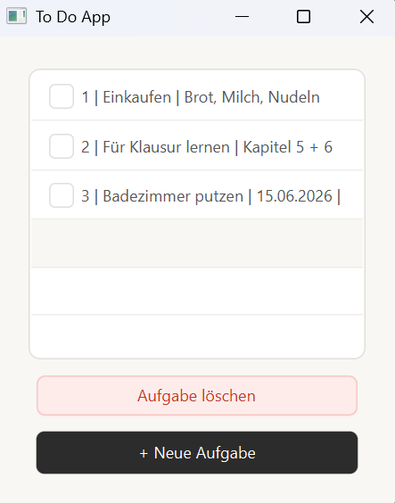
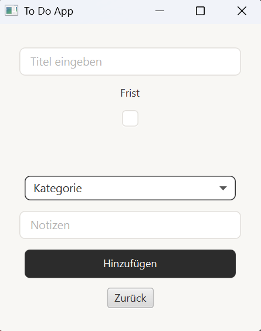

# To Do App

JavaFX-Desktopanwendung zum Verwalten von Aufgaben mit SQLite-Datenbank.

!\[To Do App](screenshots/app (1).png)

!\[To Do App](screenshots/app (2).png)

### Features

* Aufgaben hinzufügen mit Titel, Kategorie, Notizen und optionalem Fälligkeitsdatum
* Aufgaben per Checkbox abhaken und automatisch löschen
* Aufgaben löschen
* Daten werden persistent in einer SQLite-Datenbank gespeichert

### Technologien

* Java 21
* JavaFX
* SQLite (sqlite-jdbc)

### Starten

1\. Repository klonen

2\. SQLite JAR liegt bereits unter lib/sqlite-jdbc-3.51.3.0.jar

3\. Projekt in Eclipse importieren: File → Import → Existing Projects into Workspace

4\. Als Java-Applikation starten (ToDoApp.java)

### Was ich gelernt habe

* JavaFX Grundlagen (Scenes, Layouts, Event Handling)
* Eigene ListCell mit setCellFactory implementieren
* CRUD-Operationen mit JDBC und PreparedStatements
* Datenbankanbindung mit SQLite
* Git

